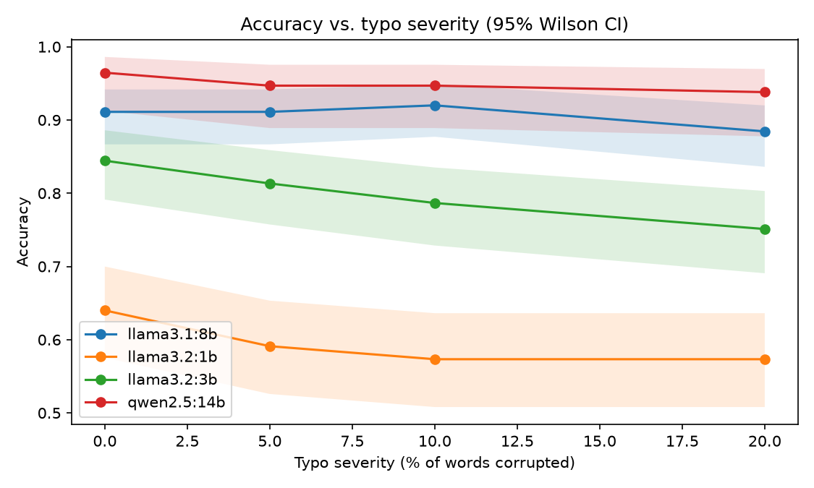
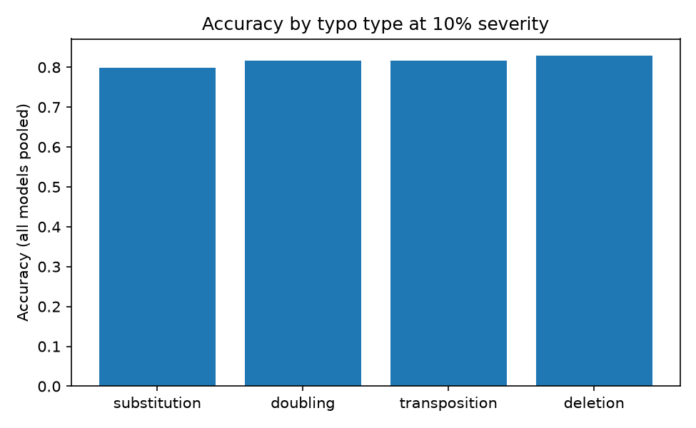
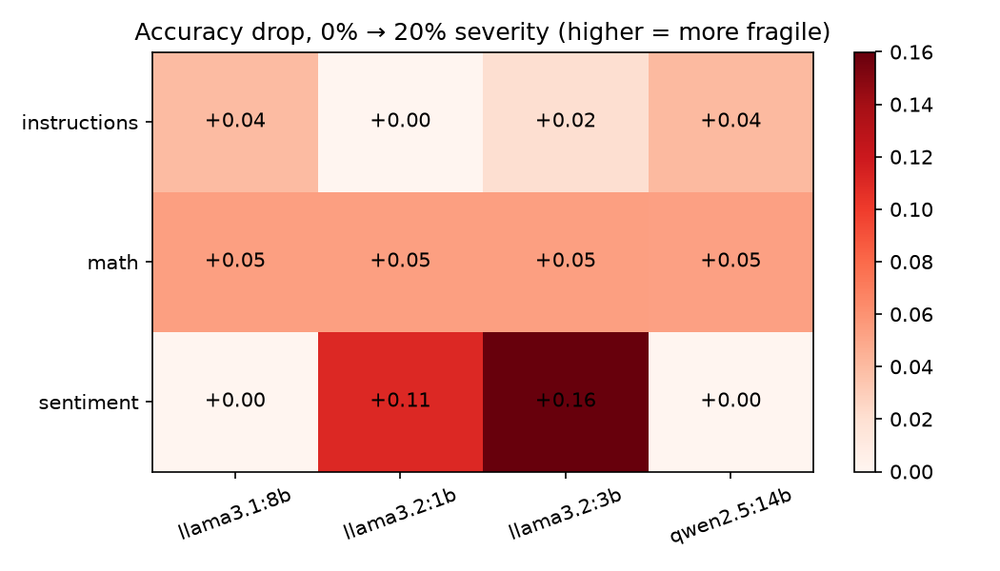

# The Typo Tax: How Prompt Typos Degrade Small vs. Large LLMs

[](https://github.com/dylanmryan/prompt-typo-robustness/actions/workflows/ci.yml)
[](LICENSE)
[](pyproject.toml)


**How much accuracy do local LLMs lose when the prompt is full of realistic typos, and does model size buy robustness?** I corrupt 0/5/10/20% of the eligible words in each prompt with a seeded, QWERTY-realistic typo engine and re-grade four Ollama models (temperature 0) on math, sentiment, and instruction-following. Across 4,960 graded trials with zero empty responses, the headline is a clear size-robustness gradient: the two small models pay a large typo tax (llama3.2:1b loses 6.7 accuracy points, llama3.2:3b loses 9.3 points from clean to 20% corruption), while the two larger models barely flinch (llama3.1:8b and qwen2.5:14b each lose 2.7 points). The honest caveat sits right next to the headline: the descriptive degradation is consistent and, for the 3B, its clean-vs-20% Wilson intervals barely overlap, but under errors clustered by prompt item the per-coefficient severity effects in a logistic model do **not** reach significance. This is a real but modestly-powered effect, and I report it as such.



## Contents

- [Headline findings](#headline-findings)
- [Results at a glance](#results-at-a-glance)
- [Method](#method)
- [Statistical honesty](#statistical-honesty)
- [Limitations](#limitations)
- [Reproduce](#reproduce)
- [Repository layout](#repository-layout)
- [Data attribution](#data-attribution)
- [Future work](#future-work)

## Headline findings

1. **Robustness scales with model size.** From 0% to 20% corruption, pooled accuracy falls 6.7 points for llama3.2:1b (64.0% → 57.3%) and 9.3 points for llama3.2:3b (84.4% → 75.1%, monotonic across all four levels), but only 2.7 points for both llama3.1:8b (91.1% → 88.4%) and qwen2.5:14b (96.5% → 93.8%). The bigger models start higher *and* degrade more slowly.
2. **Substitutions hurt most, deletions least.** In the dedicated typo-type sweep at 10% severity (pooled across all models and tasks, n=452 per type), substitution is the most damaging (79.9% accuracy), followed by transposition and doubling (both 81.6%), with deletion the mildest (83.0%). Swapping a letter for a QWERTY neighbor distorts word identity more than dropping a letter does.

   

3. **Sentiment is the most fragile task; instruction-following the most robust.** From 0% to 20% severity (pooled across models), sentiment classification drops 7.7 points (88.0% → 80.3%) and math drops 5.3 points (70.3% → 65.0%), while instruction-following loses only 2.3 points (88.6% → 86.3%).

   

4. **Typos do not change response length.** Mean response length is flat across severity (56.7 words at 0% vs. 56.8 at 20%; the four-level range is only 56.5–57.6 words). Corruption degrades correctness without making models more verbose, more terse, or triggering visible "confusion" padding.

## Results at a glance

Pooled accuracy (%) by model and typo severity, with the clean-to-worst change. Full per-cell Wilson 95% intervals are in [`results/summary.csv`](results/summary.csv).

| Model | 0% | 5% | 10% | 20% | Δ (0→20%) | n / cell |
|---|---:|---:|---:|---:|---:|---:|
| llama3.2:1b | 64.0 | 59.1 | 57.3 | 57.3 | −6.7 | 225 |
| llama3.2:3b | 84.4 | 81.3 | 78.7 | 75.1 | −9.3 | 225 |
| llama3.1:8b | 91.1 | 91.1 | 92.0 | 88.4 | −2.7 | 225 |
| qwen2.5:14b | 96.5 | 94.7 | 94.7 | 93.8 | −2.7 | 113 |

## Method

**Models.** Four instruction-tuned models served locally via Ollama at temperature 0 (greedy, deterministic): `llama3.2:1b`, `llama3.2:3b`, `llama3.1:8b`, `qwen2.5:14b`.

**Tasks and graders (one line each).**
- **math** — GSM8K word problems; graded by exact numeric match, extracting the `#### <number>` marker, else a trailing "answer is <number>" phrase, else the last number in the response.
- **sentiment** — SST-2 movie reviews; graded strictly as correct only if the response's set of label words equals exactly `{positive}` or `{negative}` (mentioning both labels is a failure).
- **instructions** — synthetic format-following items (word count, JSON keys, lowercase, starts-with, bullet count); graded by a per-item programmatic checker.

**Typo engine.** A seeded, pure-function corruptor applies four QWERTY-realistic typo types — substitution (letter → adjacent-key neighbor), transposition (swap two adjacent letters), deletion (drop a letter), and doubling (repeat a letter). **Severity** is the fraction of *eligible* words corrupted; eligible words are purely alphabetic and length ≥ 3, so digits, contractions ("don't"), and hyphenated words are left intact. Any severity > 0 corrupts at least one eligible word, so nominal severity is inflated toward `1/len(eligible)` for short prompts (a floor effect). **Validity rule:** digits are never corrupted and each task supplies a protected-token set (e.g. sentiment protects the words `positive`/`negative`), so corruptions change surface form without ever altering the ground-truth answer or leaking/erasing the target label.

**Statistics.** Per-cell accuracies are reported with Wilson 95% confidence intervals (`results/summary.csv`). For inference I fit a logistic regression `correct ~ severity * C(model)` with cluster-robust standard errors grouped by `item_id`, because the same prompt items are reused across all severity conditions and models, so trials are not independent. Reference model is `llama3.1:8b`.

## Statistical honesty

The descriptive trend is consistent: every model's accuracy is weakly monotone or flat in severity, the 3B model degrades monotonically across all four levels, and its 0%-vs-20% Wilson intervals barely overlap (84.4% [79.1, 88.6] vs. 75.1% [69.1, 80.3]). But the clustered logistic model tells a more cautious story. The overall model-vs-null fit is highly significant (LLR p = 2.7e-75), but that is driven almost entirely by **model main effects**, not by typos: the intercept-model contrasts for 1b (−1.92) and 3b (−0.78) are strongly significant (p < 0.001), simply reflecting that smaller models are less accurate everywhere. The **severity** main effect is −1.53 with p = 0.176, and none of the `severity × model` interaction coefficients reach significance (e.g. the 3b interaction is −1.27, p = 0.355). In other words: with item-clustered errors, we cannot statistically distinguish the per-model degradation slopes from noise, even though the point estimates and descriptive curves all lean the same way.

A better-powered design would need (a) more distinct items per task, and (b) multiple independent corruption samples per item × severity (this study uses a single seeded corruption per cell), which would let the model separate the typo effect from item-to-item difficulty variance that the clustered SEs currently absorb.

## Limitations

- **One prompt template per task.** Results may not generalize to alternative phrasings or system prompts.
- **Local quantized models only.** No API frontier models; quantization may affect robustness.
- **One corruption sample per item × severity.** A single seeded draw per cell; no repeated sampling to average over which words got hit.
- **qwen2.5:14b ran on a 50% item subset** (`model_item_fraction: {qwen2.5:14b: 0.5}` in `config/experiment.yaml`), taken as a deterministic first-N prefix of each dataset for wall-clock reasons; hence n=113 per cell versus n=225 for the other models.
- **The typo-type breakdown uses the deterministic first half of each dataset** (`typo_breakdown.item_fraction: 0.5`), a consequence of the same first-N prefix design rather than a random subsample.
- **Typo-type labels fall back to doubling** on words where a type cannot apply (e.g. substitution on a non-QWERTY/non-ASCII word, or transposition on a uniform word like "aaa"), so the per-type counts slightly over-represent doubling.
- **Sentiment grading is intentionally strict** (exact single-label rule): a response naming both labels is scored wrong, which blends label accuracy with instruction-following.
- **The headline degradation curve is item-weighted across tasks of differing difficulty**, not task-balanced, so pooled numbers reflect the item mix (75 math / 100 sentiment / 50 instructions) rather than an equal-task average.

## Reproduce

```bash
make venv      # create .venv and install the package + dev deps
make test      # run the test suite (79 tests)
make data      # fetch GSM8K + SST-2 and generate the synthetic instruction items
make run       # run all trials via the resumable runner (Ollama must be serving)
make analyze   # regenerate results/summary.csv, results/logit_summary.txt, and figures/
```

Every raw per-trial record is committed at `results/trials.jsonl` (4,960 rows: prompt, corrupted prompt, response, grade, latency, and the exact edits applied), so **every number in this README is verifiable without rerunning the experiment**. The runner is resumable: it keys each trial deterministically, skips completed trials on restart, and repairs a torn JSONL tail, so an interrupted run can be resumed safely.

## Repository layout

```
config/experiment.yaml     # single source of truth: models, tasks, severities, seed
src/typo_study/
  typos.py                 # seeded QWERTY typo engine (pure functions, no I/O)
  tasks.py                 # dataset loaders, prompt templates, graders, protected tokens
  ollama_client.py         # thin HTTP client: timeouts, bounded retries, fail-fast on 4xx
  runner.py                # resumable, deterministic trial-grid runner
  analysis.py              # Wilson intervals, item-clustered logistic regression, figures
scripts/                   # data-freezing + notebook builder
data/                      # frozen GSM8K / SST-2 subsets and synthetic instruction items
results/                   # committed raw trials.jsonl + summary.csv + logit_summary.txt
figures/                   # committed PNG charts
notebooks/analysis.ipynb   # executed narrative companion to the analysis
tests/                     # 79 tests (typo engine, graders, client, runner, statistics)
```

## Data attribution

- **GSM8K** — grade-school math word problems, from [openai/grade-school-math](https://github.com/openai/grade-school-math) (MIT License).
- **SST-2** — Stanford Sentiment Treebank, fetched via the HuggingFace datasets-server (`stanfordnlp/sst2`).
- **Instruction items** — synthetic, generated in-repo by `scripts/generate_instructions.py`.

## Future work

- Extend to **API frontier models** to test whether the size-robustness gradient continues past 14B.
- **Prompt-level mitigation:** measure how much an explicit "ignore any typos in the prompt" system instruction recovers.
- **Multilingual typos** and non-QWERTY keyboard-adjacency models.
- **Repeated corruption sampling** per item × severity to properly power the severity effect that this study can only describe.
